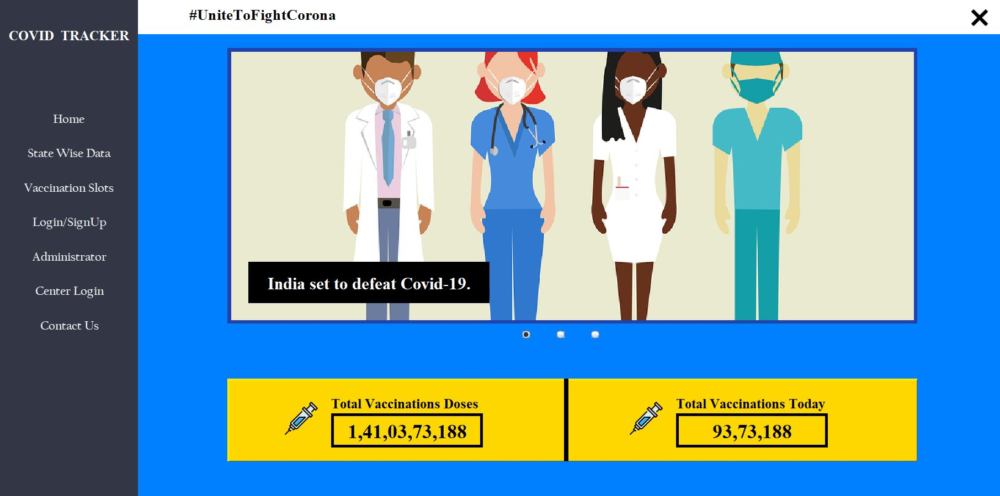
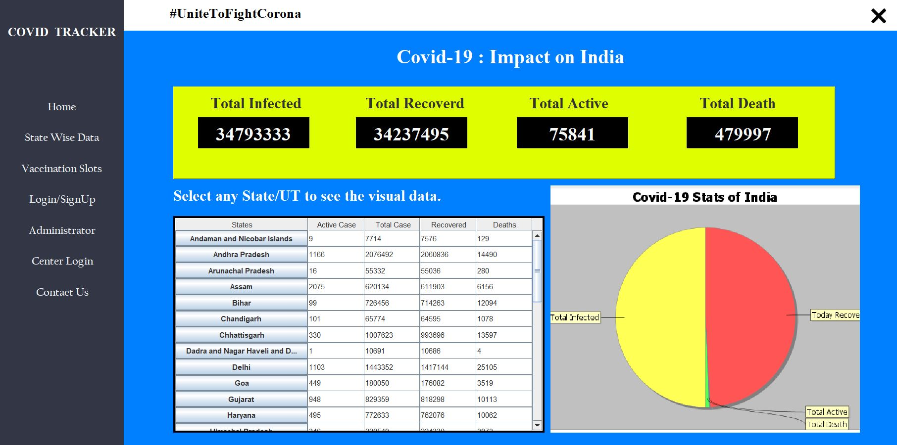
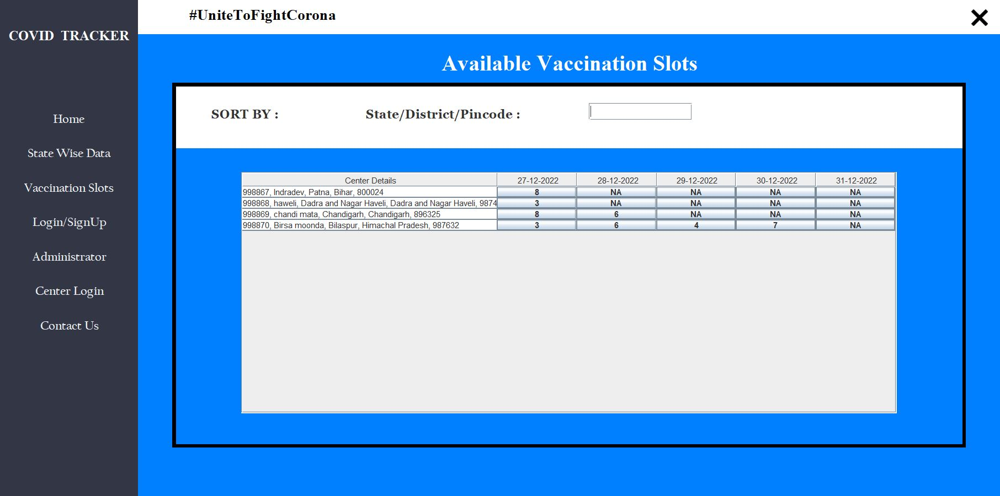
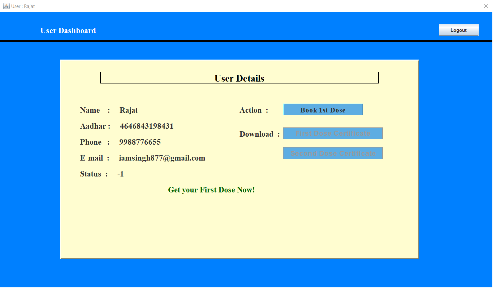
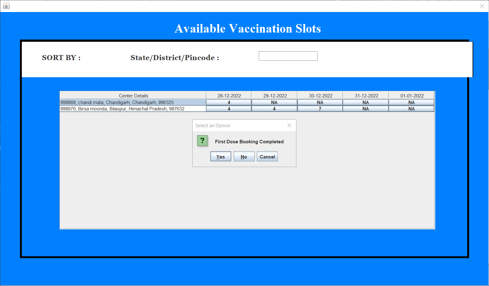
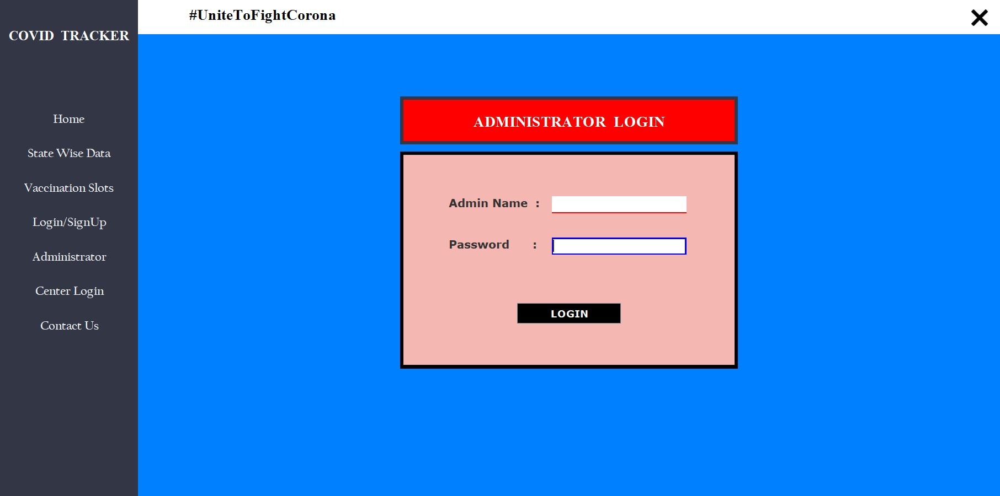
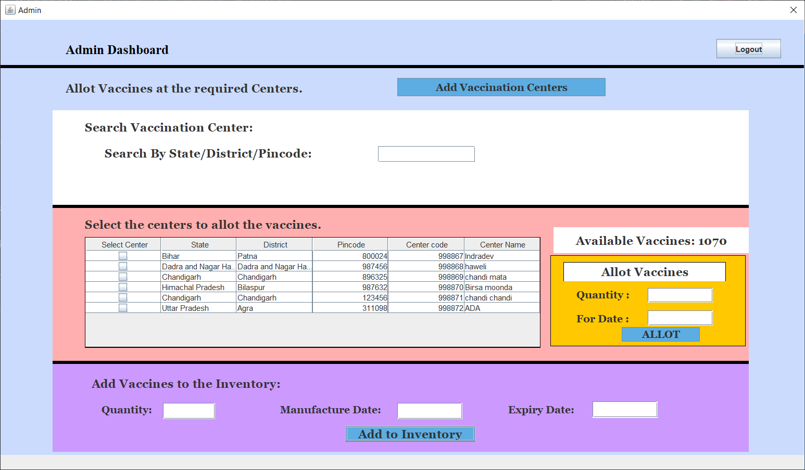
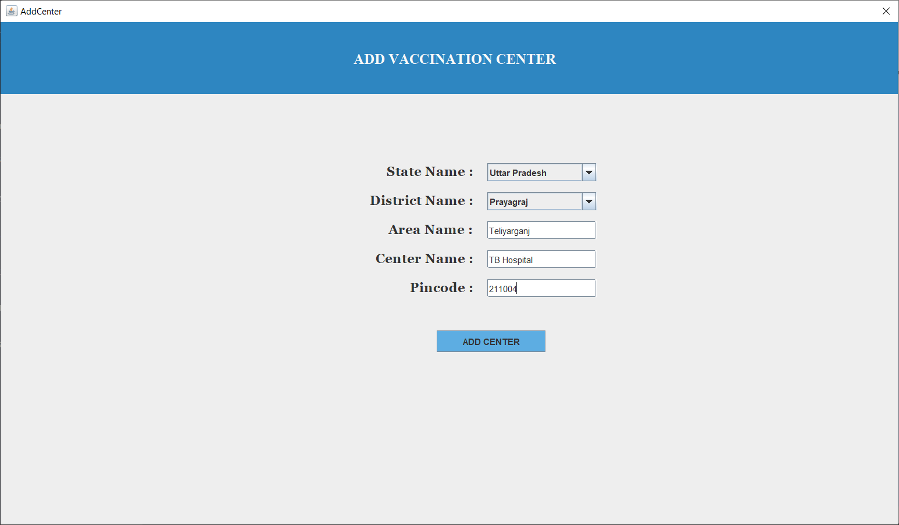
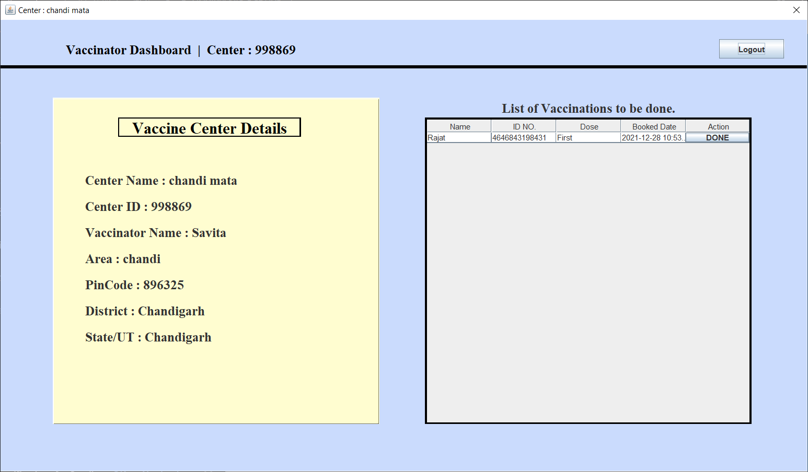
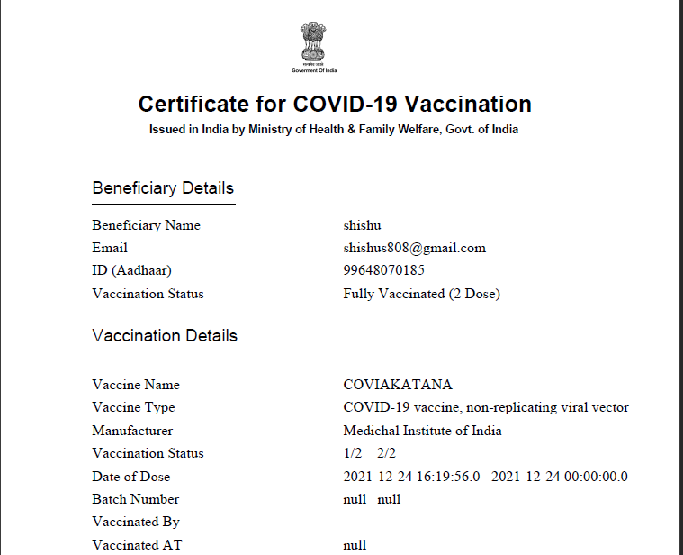

Covid Tracker

Covid Tracker is a Java Swing window application which can be used for user welfare in the current situation of the Covid-19 pandemic.
The app gives access to all the Covid-19 related data and also allows users to book slots for their vaccination. An admin panel and vaccinator panel
also exists to facilitate the functions of adding and alloting vaccines to the inventory from the government end.

## API Reference

#### Get all items

```http
  https://api.apify.com/v2/key-value-stores/toDWvRj1JpTXiM8FF/records/LATEST?disableRedirect=true
```

| Parameter | Type     | Description                |
| :-------- | :------- | :------------------------- |
| - | `string` | Get the Covid 19 data.|

#### Get item

```http
  https://dashboard.cowin.gov.in/
```

| Parameter | Type     | Description                       |
| :-------- | :------- | :-------------------------------- |
| `id`      | `string` | Vaccinations stats from a JSON file. |


## Authors

- [@ManojSingh10](https://www.github.com/ManojSingh10)
- [@shishusharma](https://www.github.com/ManojSingh10)

## 🔗 Links Shishu
[](https://www.linkedin.com/in/shishu-sharma-88026b14a/)
[](https://twitter.com/kanchaakanchaa1)

## 🔗 Links Manoj Kumar Singh
[](https://www.linkedin.com/in/manoj-singh-221b28205/)

## Features

- Provides the Covid-19 data of each state.
- Provides the Vaccination data of Total Vaccinatios and Vaccinations of the day.
- Piechart to display the statistics.
- User can register to book slots.
- User is updated about all the information after each step via the Email.
- User can downloaded certificates after successful Vaccination.
- Admin panel with facility of adding centers, adding vaccines to inventory and alloting vaccines to the centers.
- Center Login Panel for the vaccinator to update record after successful vaccination.


## Set up Environment for Covid Tracker
1. Add the database test.sql in your sytem.
2. Include all the necessary jar files in the dependencies which are available in folder 'usedapi'.
3. The dependencies such as iText is in pom.xml file.
4. Create a folder named itextExamples in the C: drive. Here, the certificate will be downloaded.
5. Run the project.
6. User can navigate through the application using the menu.
7. For slot booking, user must register themselves with their email.
8. After registration, the user can login and book the slots.
9. Once successfully vaccinated, user can download the certificate.

## Screenshots
### Representing the homepage.

### Representing the impact of Covid-19

### Representing the slots available for vaccinations.

### User login panel

### User Booking Slots

### Admin Login Page.

### Admin Panel

### Admin : Add Center

### Vaccinator Panel

### Downloaded certificate

### Activity Diagram


## Tech Stack

**Client:** Java Swing

**Server:** Xampp, JDBC, MySQL


## Demo

Following is the link of the demo video.
https://youtu.be/XI37pYJhlhg


